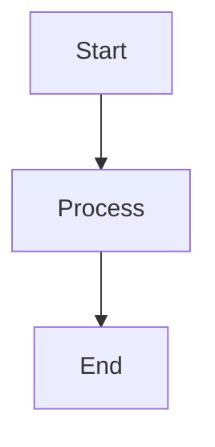

# 📄 Markdown → PDF & DOCX Converter (with Mermaid Diagrams)

This project converts a **Markdown file into professional PDF and DOCX documents**, with full support for **Mermaid diagrams** rendered as **high-resolution PNG images**.

It is designed for:

* Technical documentation
* Enterprise reports
* Architecture diagrams
* Investment / business proposals
* Presentation-ready PDFs

---

# 🚀 Features

* Markdown → PDF (wkhtmltopdf engine)
* Markdown → DOCX (Pandoc)
* Mermaid diagrams → High-quality PNG (scale 3)
* Automatic diagram detection and replacement
* Stable PDF generation (no freezing)
* Windows-compatible pipeline
* Production-grade output quality

---

# 🧱 Architecture

```text id="mdflow"
nsp.md
   ↓
md2pdf2word.py
   ↓
Mermaid (mmdc) → PNG (high resolution)
   ↓
Processed Markdown
   ↓
Pandoc → HTML → wkhtmltopdf → PDF
   ↓
Pandoc → DOCX
```

---

# 📦 Requirements

## 1. Python

* Python 3.10+

No external Python libraries required.

---

## 2. Node.js (for Mermaid CLI)

Install Node.js:
[https://nodejs.org/](https://nodejs.org/)

Install Mermaid CLI:

```bash id="mmdc_install"
npm install -g @mermaid-js/mermaid-cli
```

---

## 3. Pandoc

Download:
[https://pandoc.org/installing.html](https://pandoc.org/installing.html)

Verify:

```bash id="pandoc_check"
pandoc -v
```

---

## 4. wkhtmltopdf

Download:
[https://wkhtmltopdf.org/downloads.html](https://wkhtmltopdf.org/downloads.html)

Ensure PATH includes:

```text id="wk_path"
C:\Program Files\wkhtmltopdf\bin
```

Verify:

```bash id="wk_check"
wkhtmltopdf -V
```

---

# 📁 Project Structure

```text id="structure"
project/
│
├── nsp.md
├── md2pdf2word.py        # Main script
├── processed.md          # Auto-generated
│
├── chart_0.mmd           # Temporary Mermaid input
├── chart_0.png           # Generated diagrams
│
├── blueprint.pdf        # Final PDF output
└── blueprint.docx       # Final Word output
```

---

# ▶️ How to Run

Run the script:

```bash id="run_script"
python md2pdf2word.py
```

---

# ⚙️ Configuration

Inside `md2pdf2word.py`:

```python id="config"
INPUT_MD = "nsp.md"
TEMP_MD = "processed.md"

OUTPUT_PDF = "blueprint.pdf"
OUTPUT_DOCX = "blueprint.docx"
```

---

# 📊 Supported Mermaid Diagrams

* Flowcharts
* Pie charts
* Sequence diagrams
* Gantt charts
* Architecture diagrams
* Org charts

Example:



---

# 🖼️ Diagram Rendering Quality

Mermaid diagrams are rendered as:

* Format: PNG
* Scale: 3x (high resolution)
* Background: transparent

This ensures:

* crisp zoom quality
* print-ready output
* stable PDF rendering

---

# 📄 PDF Generation Engine

Uses:

* wkhtmltopdf
* A4 page format
* 300 DPI rendering
* zoom optimization (1.25x)

---

# ⚠️ Known Limitations

* Very large documents may slow rendering
* SVG is intentionally avoided (causes freezing)
* wkhtmltopdf has limited modern JS support

---

# 🧠 Why PNG instead of SVG?

SVG caused:

* freezing at ~28% PDF generation
* memory spikes
* unstable rendering

PNG with scale 3 provides:

* stable output
* high clarity
* consistent PDF generation

---

# 🔧 Troubleshooting

## ❌ mmdc not found

```bash id="fix_mmdc"
npm install -g @mermaid-js/mermaid-cli
```

## ❌ pandoc not found

Install and add to PATH.

## ❌ wkhtmltopdf not working

Ensure:

```text id="fix_wk"
C:\Program Files\wkhtmltopdf\bin
```

is in system PATH.

---

# 🚀 Future Enhancements

* Auto page breaks per section
* Cover page branding
* Table of contents generation
* Header/footer templates
* Slide-style PDF mode
* Dark/light diagram themes
* Logo integration (enterprise reports)

---

# 📜 License

Internal / Custom Enterprise Tool

---

# 👨‍💻 Script Entry Point

Main file:

```text id="entry"
md2pdf2word.py
```

Run:

```bash id="run"
python md2pdf2word.py
```

---
